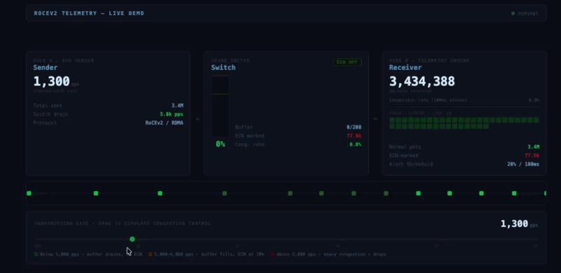

# RoCEv2 Congestion Telemetry Engine

A kernel-bypass, zero-copy RDMA congestion detection engine simulating the DMA and telemetry path of a RoCEv2-capable NIC.



## How it works

A Linux kernel module (`mock_nic.c`) allocates a physically contiguous page via `kmalloc` and maps it into userspace, mirroring how a NIC driver exposes its DMA ring. Two userspace threads share that page:

- **SimulatorThread** - writes RoCEv2 packets into the page (mock DMA), using the doorbell pattern: `congestion_flag` is written first, `sequence_number` last. The sequence number increment is the signal that the descriptor is fully committed.
- **TelemetryThread** - busy-polls on `sequence_number` via a `volatile` pointer, reads `congestion_flag` on each new packet, and feeds results into a DCQCN sliding window to detect congestion above a 20% ECN threshold.

When the threshold is crossed, the engine raises an alert.

## Stack

- Linux kernel module (C), userspace engine (C++20)
- Multithreading — `SimulatorThread` and `TelemetryThread` communicate lock-free over shared memory; `std::mutex` guards the aggregated metrics channel
- Claude Code project configuration — `CLAUDE.md`, `AGENT.md`, `settings.json`, and automated hooks.

## Running the Project

This project requires a Linux environment.
See [VM_SETUP.md](VM_SETUP.md) for the full explanation and setup instructions.
Once you have a Linux environment with dependencies installed:

```bash
git clone https://github.com/elads888/RoCEv2-congestion-telemetry-engine.git
cd RoCEv2-congestion-telemetry-engine
chmod +x scripts/run_demo.sh
```

Run in normal mode:

```bash
sudo bash scripts/run_demo.sh
```

Run in slow mode:

```bash
sudo ROCEV2_SLOW_MODE=1 bash scripts/run_demo.sh
```

Then open your browser on host at `http://<vm-ip>:8080`.
